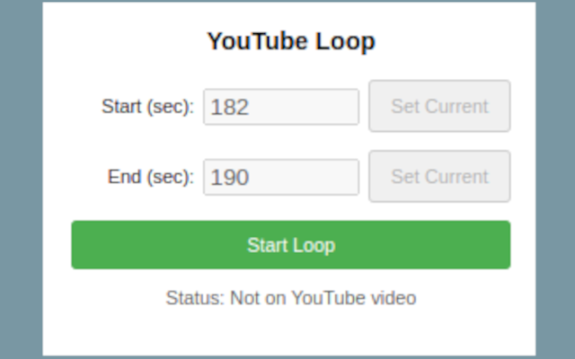

# YouTube Loop Chrome Extension

[](manifest.json)
[](LICENSE) 
[-lightgrey)](PLACEHOLDER_LINK_TO_STORE)
A simple Chrome extension to loop a selected time section of any YouTube video.


*(Screenshot showing the extension popup with start/end time inputs)*

---

## Features

* Set custom start and end times (in seconds) for a video loop.
* Quickly set start/end times based on the video's current playback position using "Set Current" buttons.
* Simple toggle button in the popup to activate or deactivate the loop.
* Remembers the last used start and end times for convenience (using local browser storage).
* Runs directly on YouTube video pages (`youtube.com`).
* Minimal permissions required.

---

## Installation

### 1. From Chrome Web Store (Recommended)

* Go to the [YouTube Loop Extension Page on the Chrome Web Store](PLACEHOLDER_LINK_TO_STORE) *(Link will be available after publishing)*.
* Click "Add to Chrome".

### 2. From Source (For Developers)

1.  Clone this repository or download it as a ZIP file.
    ```bash
    git clone [git@github.com:msbCyricTohoku/YouTube-loop-extension.git](git@github.com:msbCyricTohoku/YouTube-loop-extension.git) 
    ```
    (Replace with your actual repository URL)
2.  Open Google Chrome and navigate to `chrome://extensions/`.
3.  Enable **Developer mode** using the toggle switch in the top-right corner.
4.  Click the **Load unpacked** button.
5.  Select the directory where you cloned or unzipped the repository files (the folder containing `manifest.json`).
6.  The extension should now be installed locally.

---

## Usage

1.  Navigate to any video page on `www.youtube.com`.
2.  Click the **YouTube Loop** extension icon in your Chrome toolbar (it looks like [Describe Icon or add small icon image if possible]).
3.  A popup window will appear.
4.  Enter the desired **Start Time** and **End Time** in seconds into the input fields.
5.  *Alternatively*, play the video to the desired start or end points and click the corresponding "**Set Current**" button in the popup to capture the current video time.
6.  Click the "**Start Loop**" button. The button text will change to "**Stop Loop**" and the status will indicate looping is active.
7.  The video player will now automatically jump back to the **Start Time** whenever it reaches the **End Time**.
8.  To stop the loop, click the "**Stop Loop**" button in the popup.

---

## Privacy

Your privacy is important. This extension operates entirely locally within your browser.
* It handles the start/end times you provide only to control the video loop.
* It stores these times locally using `chrome.storage` for your convenience.
* **It does not collect any Personally Identifiable Information (PII).**
* **It does not transmit any data to the developer or any third parties.**

Please read the full [Privacy Policy](privacy.html) for more details. *(Update this link if you host the policy elsewhere)*

---

## License

This project is licensed under the GNU General Public License v3.0 - see the [LICENSE](LICENSE) file for details.

---

*This README was last updated on April 12, 2025.*